# Gridpainter

## Demolink

https://github.com/YeseniaCM/gridsock-8-Gridpainter

# Application requirements

Our first collaborative fullstack game-application which explores the world of socket.io and realtime communication and a first time attempt at deploying using DigitalOcean!
These are the technical requirements for our assignment:

- The application should have a login feature.
- It should allow the creation of users, with a minimum requirement of having at least 4 users logged in simultaneously.
- Users should be able to collaborate in real-time to paint a picture together.
- Additionally, users should have the capability to engage in chat conversations with each other.
- The application should provide 5 images as "templates" for users to paint.
- The painting area should consist of a 15 x 15 grid.

# The following should happen

- Save the painted picture and open it again.
- Each user should automatically be assigned a color when the game starts, which they paint with
- All users should see the original image for 3 - 4 seconds
- When everyone has clicked "done", the picture should be corrected. Accuracy is displayed in %.
- The images should be randomized when a session starts.
- The chat is continuous during the game, when an image is opened a chat room is created for that image. When the image is finished, the chat for that image is also closed.

## Authors

- [@Pingis2](https://github.com/Pingis2)
- [@CeciliaL1](https://github.com/CeciliaL1)
- [@YeseniaCM](https://github.com/YeseniaCM)
- [@alahojat](https://www.github.com/alahojat)

## Project built with


## Initial Wireframes

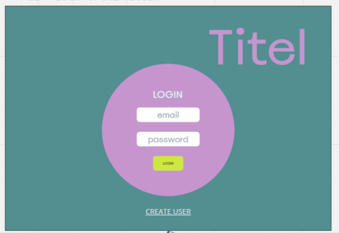
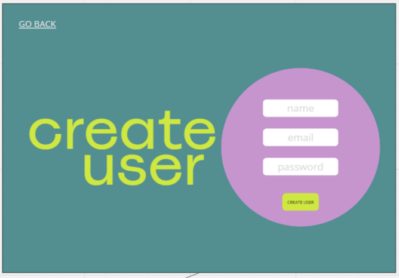
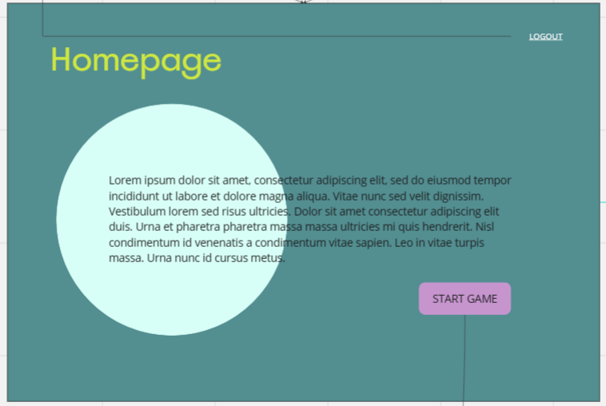
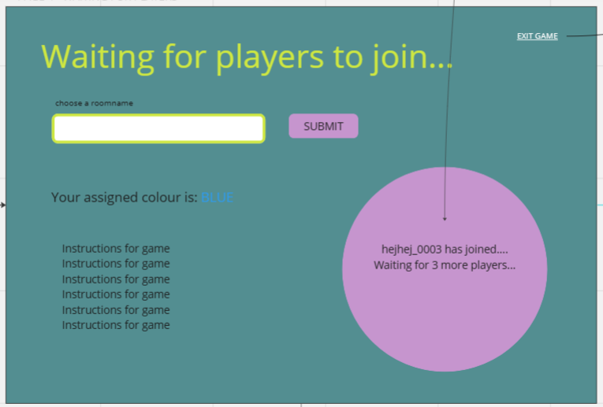
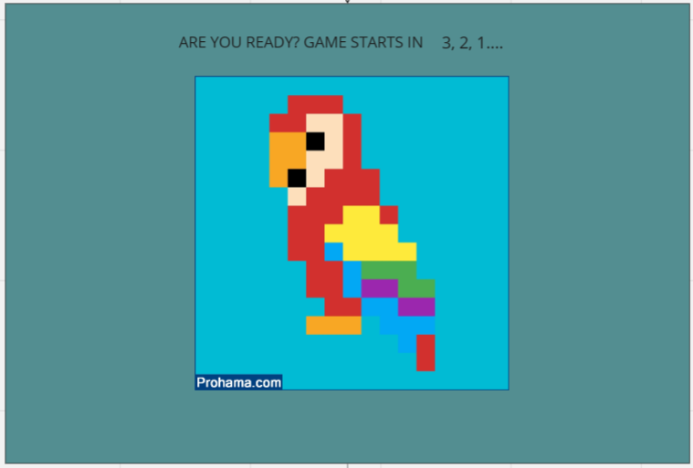
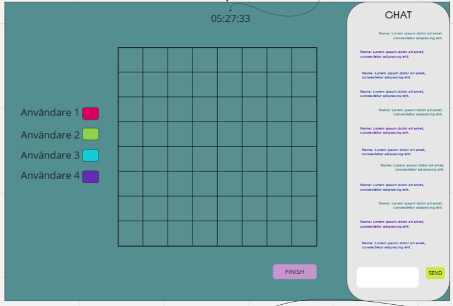
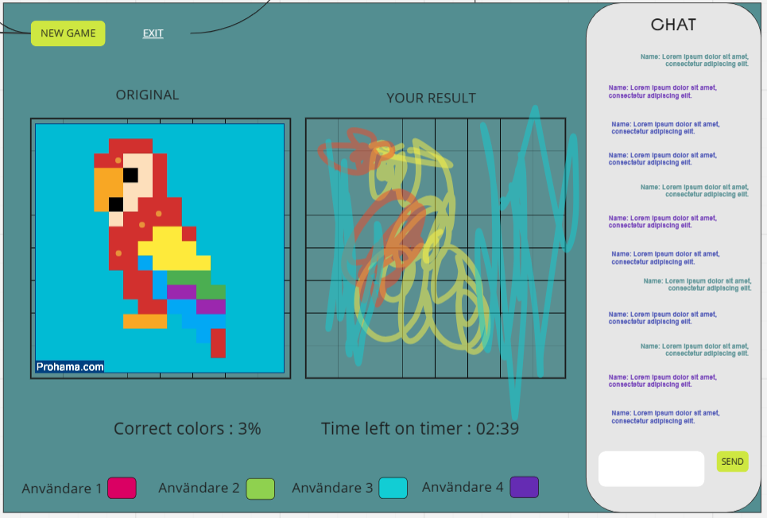

## Final result

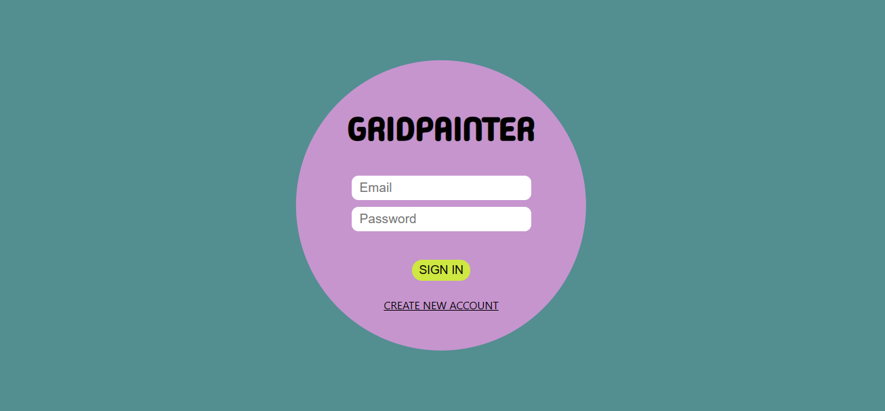
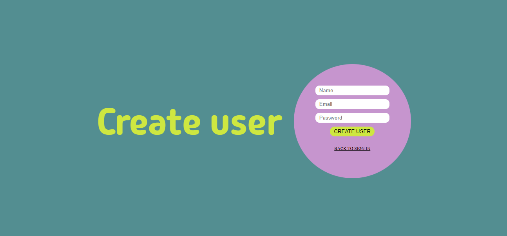
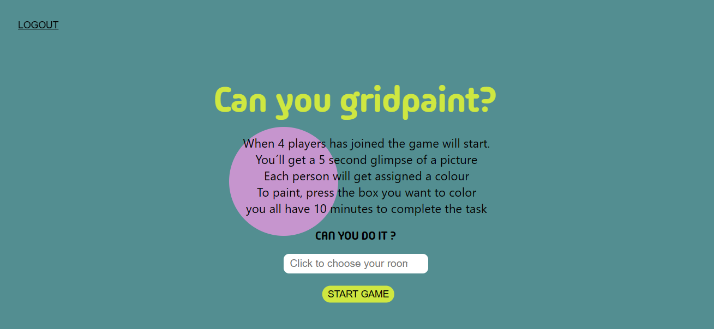
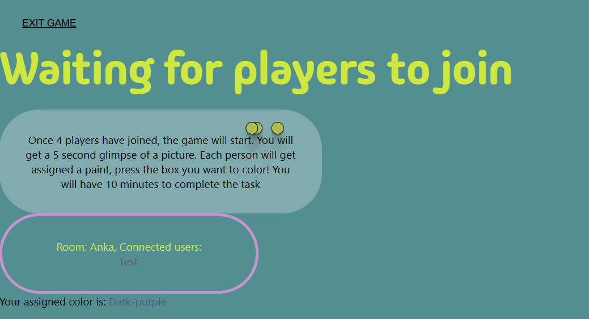
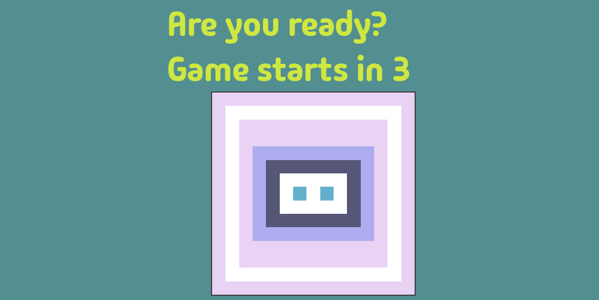
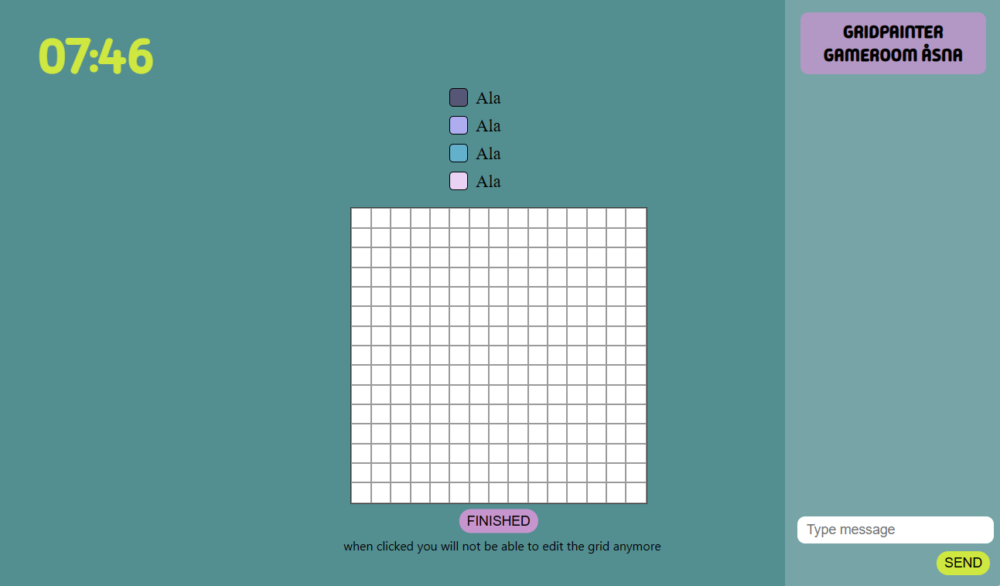
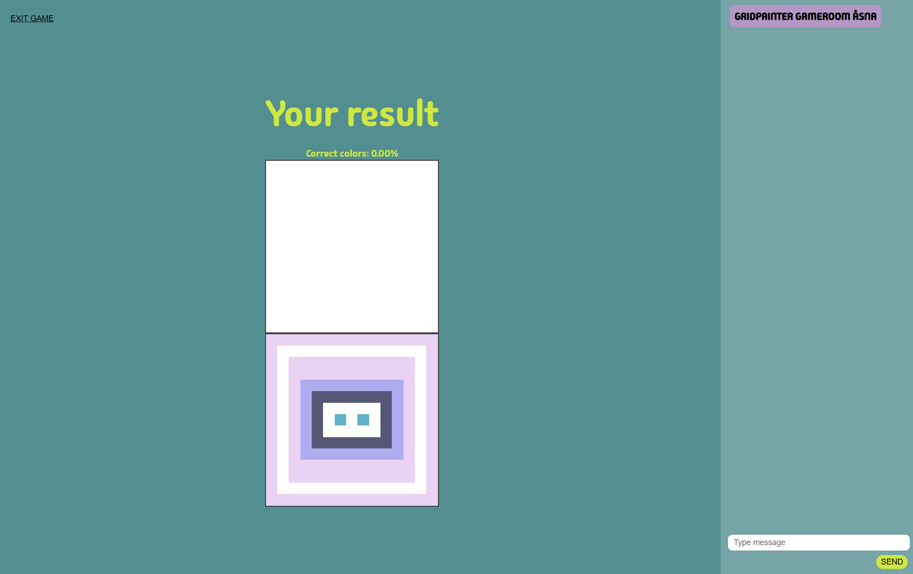

## Project directory

```
server
client
```

## Start project

```
npm install
```

## Start server

```
nodemon start
```

## Dependencies

```
socket.io-client
socket.io
gsap
cors
crypto-js
dotenv
mysql2

```

## Lessons learned

The challenges of this project for us had mainly to do with navigating the communication between socket.io and socket.io-client. Understanding the dynamic of socket.io and its events as well as understanding the ways in which connections are established proved to be challenging for us as a group. The general takeaways ahead of future socket.io applications would be to understand the fundamentals of socket.io and its concepts to allow for more effective debugging, testing as well as creative solutions to achieve a desired outcome.

## Detected bugs

At point of hand-in of assignment we have come across bugs related to the functionality of the timer and its ability to clear when all players have finished and pressed their 'finish'-button.
Currently despite debugging and testing across several days the function to clear the interval doesn't seem to be applied correctly. And consequently, our 'no time left' - page is therefore reprinted each second, causing a large bug. Given more time and perhaps more experience regarding socket.io we would hopefully be able to detect and solve the issue at hand. Let's just call it a feature!
